# Architecture

This document explains how the application is put together and why. It uses the seating
domain throughout — events, the tables on their floor plans, and the seats around those tables
— because a concrete example is easier to check against the code than a description of a
pattern.

Read `AGENTS.md` for the rules a change must obey. This file is the reasoning behind them.

- [1. High-level runtime](#1-high-level-runtime)
- [2. Request flow](#2-request-flow)
- [3. Action and use-case flow](#3-action-and-use-case-flow)
- [4. Human and agent parity](#4-human-and-agent-parity)
- [5. Authentication versus authorization](#5-authentication-versus-authorization)
- [6. Organization scoping](#6-organization-scoping)
- [7. Layer boundaries](#7-layer-boundaries)
- [8. Integration ports and adapters](#8-integration-ports-and-adapters)
- [9. Audit, history and undo](#9-audit-history-and-undo)
- [10. Two schema owners](#10-two-schema-owners)
- [11. CI and CD](#11-ci-and-cd)
- [12. Staging and production separation](#12-staging-and-production-separation)
- [13. Backup and recovery](#13-backup-and-recovery)
- [14. What this design deliberately avoids](#14-what-this-design-deliberately-avoids)

---

## 1. High-level runtime

One always-on Node process serves everything: the static React shell, the framework's own
endpoints, the application's actions, the agent chat stream and the MCP endpoint. There is one
database.

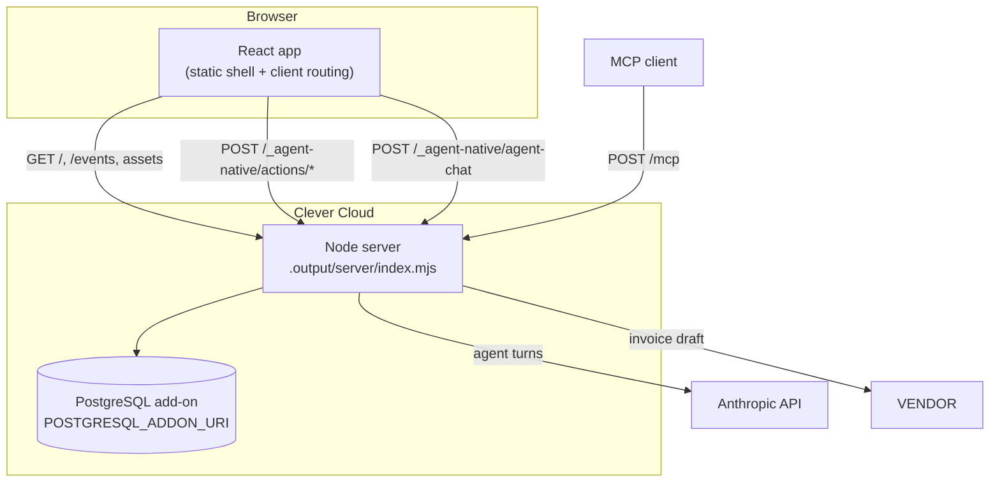

Two things about this picture are worth knowing before you debug anything.

**`/` is a static shell.** The build renders the HTML at build time and the server returns it
for `GET /` without running a loader. The redirect to `/events` is therefore client-side
(`<Navigate to="/events" replace />` in `app/routes/_index.tsx`); a loader `redirect()` there
breaks the static-shell render, and a smoke test must expect 200 from `/`, never a 302.

**The sync channel polls.** The framework's `useDbSync` prefers an `EventSource` on
`/_agent-native/events`. `app/root.tsx` passes `sseUrl: false`, so the framework's
`/_agent-native/poll` transport is used instead.

That choice was forced: on Cloudflare Workers a response held open with no pending I/O is cancelled by the
runtime. On an always-on Node process it no longer is, so switching back to the event stream is
now _available_ — a lower-latency sync channel for one line of change. It has not been taken,
because polling works and a change to how every client receives updates deserves its own
measurement rather than riding along with a migration.

The build is `agent-native build` with the Node preset, producing `.output/`, which `pnpm start`
serves. No bundle patching, no runtime surgery — the two stub patches this repository used to
carry existed only because of the Cloudflare bundle and went with it.

## 2. Request flow

A mutation from the browser, end to end:

```mermaid
sequenceDiagram
  participant B as Browser
  participant M as Nitro middleware
  participant A as actions/move-seating-table.ts
  participant R as runAppAction
  participant U as moveSeatingTable (use case)
  participant D as src/domain/seating-table.ts
  participant Repo as SeatingTableRepository (SQL)
  participant Audit as agent_audit_log

  B->>M: POST /_agent-native/actions/move-seating-table<br/>X-Agent-Native-Frontend: 1
  M->>M: security headers; session -> userEmail, orgId
  M->>A: validate args against the Zod schema
  A->>R: run(args, ctx)
  R->>Repo: getRole(orgId, userEmail)
  R->>U: moveSeatingTable(deps, actor, args)
  U->>U: requireCapability(actor, "seating:write")
  U->>Repo: getById(orgId, tableId), list(orgId, { eventId })
  U->>D: moveSeatingTable(table, to, siblings, now)
  D-->>U: next table, version + 1
  U->>Repo: commit({ table: next, expectedVersion, operation })
  Repo->>Repo: one atomic batch, both statements guarded on expectedVersion
  Repo-->>U: ok, or CONFLICT when zero rows matched
  U-->>R: { resource, operationId }
  R->>R: one JSON log line
  R-->>A: result
  A->>Audit: framework writes the audit row
  A-->>B: 200 { resource, operationId }
```

Everything the request needs to be safe happens in the middle of that diagram, on the server:
identity from the session, role from the database, capability from the policy module, invariant
from the domain, concurrency from the SQL guard. The browser contributes arguments and nothing
else.

Failures leave through one door. `runAppAction` catches everything, maps it to an `AppError`
and returns the framework's `fail(...)`, which is the only way a message, an `errorCode` and an
HTTP status survive to the caller. A bare `throw` would become an opaque 500.

| `AppErrorCode`   | HTTP | Meaning                                                              |
| ---------------- | ---- | -------------------------------------------------------------------- |
| `VALIDATION`     | 400  | The arguments are wrong.                                             |
| `AUTHENTICATION` | 401  | Nobody is signed in.                                                 |
| `AUTHORIZATION`  | 403  | Signed in, not allowed, or not a member of this organization.        |
| `NOT_FOUND`      | 404  | No such record **in your organization**.                             |
| `CONFLICT`       | 409  | Somebody else changed it first.                                      |
| `INVARIANT`      | 422  | A domain rule refuses this transition.                               |
| `EXTERNAL`       | 502  | A vendor call did not confirm.                                       |
| `INTERNAL`       | 500  | Something unanticipated. The message is always `"Unexpected error"`. |

## 3. Action and use-case flow

An action file is a declaration. It carries the description the agent reads, the Zod schema,
the audit metadata and one call to `runAppAction`. It contains no logic, and it is not allowed
to import infrastructure.

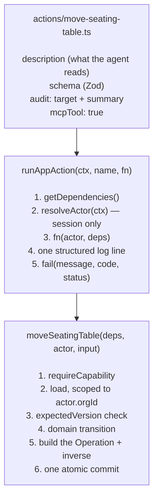

The whole of `actions/move-seating-table.ts`, minus the strings:

```ts
export default defineAction({
  description:
    "Move a table to a different place on its event's floor plan. …Reversible…",
  schema: z.object({
    tableId: z.string().min(1).describe("Id of the table to move"),
    gridX: z.number().int().min(0).describe("New left edge in grid cells"),
    gridY: z.number().int().min(0).describe("New top edge in grid cells"),
    expectedVersion: z
      .number()
      .int()
      .positive()
      .optional()
      .describe("…CONFLICT if it changed"),
  }),
  mcpTool: true,
  audit: {
    target: (args) => ({
      type: "seating_table",
      id: args.tableId,
      visibility: "org",
    }),
    summary: (args) =>
      `Moved table ${args.tableId} to ${args.gridX},${args.gridY}`,
  },
  run: (args, ctx) =>
    runAppAction(ctx, "move-seating-table", (actor, deps) =>
      moveSeatingTable(deps, actor, args),
    ),
});
```

And the use case it delegates to, `src/application/use-cases/move-seating-table.ts`: require
`seating:write`; load the table scoped to `actor.orgId` and 404 if it is not there; refuse with
`CONFLICT` if `expectedVersion` disagrees; load the event's other tables and call the domain's
`moveSeatingTable(table, to, siblings, now)`, which throws `INVARIANT` when the destination is
off the grid or on top of one of them; build an `Operation` whose `inverse` is
`{ type: "restore-seating-table-position", previous: { gridX, gridY } }`; and commit the new
table, that operation and the table's whole occupancy in one atomic batch, every statement
guarded on the version the caller read.

Occupancy is worth pausing on, because it is the one rule in this application that a version
check cannot express. Two people dragging two _different_ tables onto the same cell each pass
their own version check — neither has touched the other's row — and each passed the domain's
overlap check against a snapshot taken before the other wrote.

So it is stated as data instead. `seating_cells` holds one row per cell a table covers, keyed
`(org_id, event_id, x, y)`, and every seating write rewrites its table's cells inside the same
batch as the table itself. The second writer violates that primary key, loses the whole batch,
and is told `CONFLICT` rather than leaving an overlapping floor plan behind. The domain check
stays because it produces the better message in the ordinary single-user case; the database is
the authority.

Cells rather than a bounding rectangle, because a rectangle cannot describe the shapes people
build. A table with end seats leaves its four corners empty, and a seat that has been taken
away leaves its own cell empty — which is exactly how two tables are brought together at a
right angle to make an L or a U: the chairs at the join come off, and the other
table's body stands where they were.

The action name is the file name. `actions/move-seating-table.ts` is `move-seating-table` as an
agent tool, as `POST /_agent-native/actions/move-seating-table`, as an MCP tool, and as
`pnpm action move-seating-table`. That is the mechanism behind parity: there is nowhere else to
put a second implementation.

`docs/actions-and-use-cases.md` has the full anatomy, the error table, the idempotency rules
and the action catalogue.

## 4. Human and agent parity

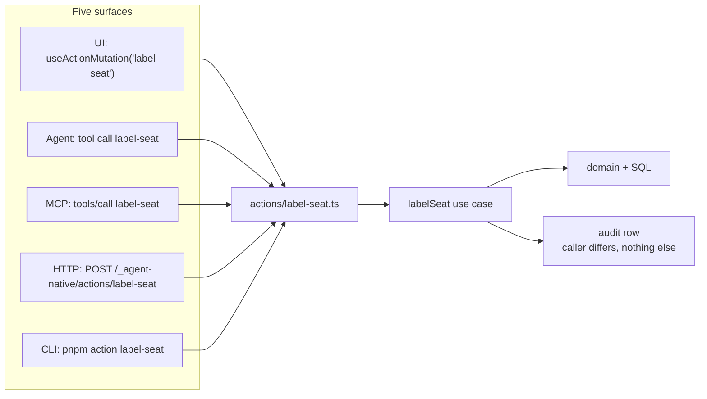

| Surface       | How it is invoked                             | `ctx.caller` | Identity from                      |
| ------------- | --------------------------------------------- | ------------ | ---------------------------------- |
| UI click      | `useActionMutation("label-seat")`             | `frontend`   | Session cookie                     |
| Agent request | the model calls the `label-seat` tool         | `tool`       | The signed-in user's session       |
| MCP call      | `tools/call` with `label-seat`                | `mcp`        | Bearer token or session            |
| HTTP call     | `POST /_agent-native/actions/label-seat`      | `http`       | Session cookie                     |
| CLI call      | `pnpm action label-seat '{"tableId":"…", …}'` | `cli`        | `AGENT_USER_EMAIL`, `AGENT_ORG_ID` |

All five reach the same action, the same use case, the same capability check and the same SQL.
`tests/e2e/parity.spec.ts` proves it the only way that counts: it writes the same seat label
through the UI and over HTTP and asserts the two audit rows differ **only** in `caller`.

The agent's tool surface is deliberately narrow: `frameworkTools: { preset: "minimal",
database: "off", audit: true }`. The framework's generic database tools are off on every
surface, so the agent cannot read or write a table; it has our semantic actions, `view-screen`
and `navigate`. MCP exposes the semantic actions only. `agent/AGENTS.md` is the deployed
agent's system prompt and describes the same actions in the same terms.

## 5. Authentication versus authorization

Two different questions, answered in two different places, in this order. Before either one,
the global request policy rejects framework organization self-admission routes; only invitation
acceptance can give a signed-in person a membership. The first owner is provisioned by the
trusted operator bootstrap procedure in `docs/bootstrap.md`.

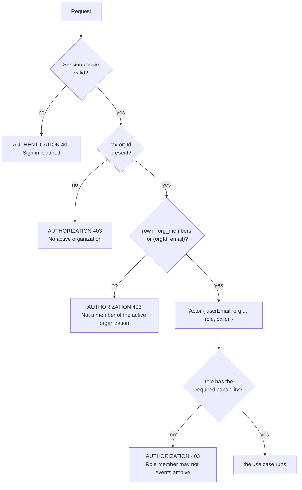

**Authentication** is the framework's: Better Auth, the `an_session` cookie, Google or
password depending on the environment. The application never implements it and never inspects
a token.

**Authorization** is ours, and it is not the framework's `authorize` hook. `src/application/authorization.ts`
maps the three organization roles to seven capabilities, and every use case calls
`requireCapability(actor, cap)` on itself. Two reasons: the check is then unit-testable with
plain in-memory doubles and no framework, and it is provably identical on every surface because
there is one call site per use case and no way to reach the use case without passing it.

| Capability                      | member | admin | owner |
| ------------------------------- | :----: | :---: | :---: |
| `events:read`, `events:create`  |   ✓    |   ✓   |   ✓   |
| `seating:read`, `seating:write` |   ✓    |   ✓   |   ✓   |
| `history:read`, `history:undo`  |   ✓    |   ✓   |   ✓   |
| `events:archive`                |   —    |   ✓   |   ✓   |

Every seating change shares one capability on purpose: there is no role that should be able to
move a table but not label a seat, and the rule of thumb in `docs/adding-a-feature.md` is to
reuse a capability unless a role should hold one half of it. `events:archive` is separate
because it hides a whole floor plan at once.

The UI hides the archive button from a member using `useOrgRole()`. That is courtesy, not
security: `tests/e2e/authorization.spec.ts` calls `archive-event` over HTTP as a member and
asserts 403.

History has its own rule, because undo must not become a capability laundering service:
reversing an operation requires `history:undo` **and** the capability for the business effect
the reversal has. A member may compensate their own `create-event` (it archives the event they
just made), but may not undo an admin's archive — that needs `events:archive`.
`src/application/history-policy.ts` is the whole policy, and the activity feed's Undo/Redo
buttons are computed from it, evaluated against the caller's **current** role.

## 6. Organization scoping

Tenancy is not a middleware and not an ORM feature. It is a parameter that every read and write
carries, and a predicate in every statement.

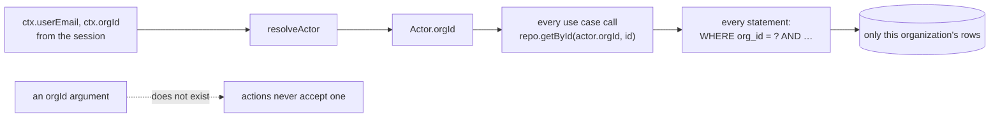

Four properties hold together:

1. **Actions never take an `orgId`.** The active organization comes from the request context
   only, so a caller cannot ask about another one. There is no argument to tamper with.
2. **The role is read fresh** from `org_members` for that `(orgId, email)` pair on every call.
   A session carrying a stale `orgId` finds no membership and is refused.
3. **Every SQL constant contains `org_id = ?`.** `tests/unit/infrastructure/sql-scoping.test.ts`
   imports `src/infrastructure/sql/sql.ts` and asserts it for every exported statement; the
   optional filter fragments are checked against a fixed `AND <column> <op> ?` allow-list, so
   no caller value can reach the SQL text.
4. **A foreign record is `NOT_FOUND`, never `AUTHORIZATION`.** "That event exists but is not
   yours" is information; the seed's second organization (`org_other`) exists so every layer can
   be tested for the leak. `tests/e2e/isolation.spec.ts` navigates an outsider to
   `/events/evt_gala` and asserts the not-found state, and `get-event` returns 404 over HTTP.

## 7. Layer boundaries

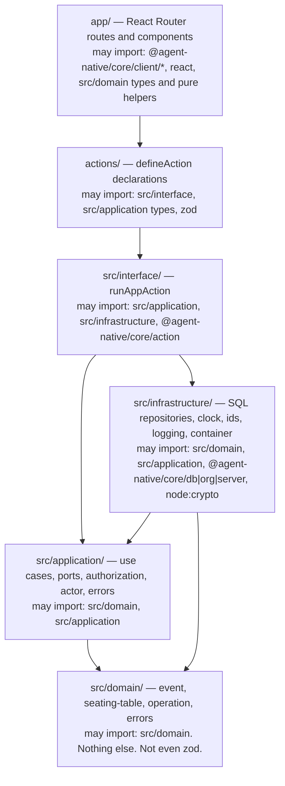

The rules are in a table in `AGENTS.md` and enforced by `scripts/check-boundaries.mjs`, which
parses every TS and TSX file with a pinned `@babel/parser` and fails the build with a file, a
line and the offending specifier. It understands multiline imports, side-effect imports,
dynamic `import("…")` with a literal, type-only imports and re-exports, so formatting cannot
hide a violation. Its own regression fixtures prove it still catches each form.

Why each rule earns its keep:

- **`src/domain` imports nothing.** Not `zod`, not `node:*`, not the framework. Time is an
  argument, ids are arguments, there is no I/O. That is what makes the transition rules
  testable in microseconds and readable without any context, and it is why upgrading the
  framework cannot change what "two tables may not overlap" means.
- **`src/application` cannot see the framework.** A use case that could reach `getDbExec()`
  would eventually reach it, and the layer would stop being testable with in-memory doubles.
  Dependencies arrive as a `Dependencies` object of plain interfaces.
- **`app/` cannot see `src/application`.** A UI that can call a use case directly will one day
  call it without the action wrapper, and lose the audit row, the log line and the error
  mapping. Route components fetch through `useActionQuery` and mutate through
  `useActionMutation`; the only thing they may import from `src` is a domain **type**.
- **`actions/` cannot see `src/infrastructure`.** An action that builds its own repository is an
  action that has its own idea of tenancy.

`src/infrastructure/container.ts` is the one file that knows which adapter implements which
port. It memoises the repository objects but never the executor: `getDbExec()` resolves the
binding of the request being served, so a cached executor could outlive its request.

## 8. Integration ports and adapters

This application calls no external system, so there is no adapter to read here. The section
stays because the boundary it describes is part of the architecture, and because the moment a
seating plan has to be handed to a caterer, a venue or a printer, this is the shape that call
has to take.

The interesting case is not "we call an API". It is "we call an API and the call may have
succeeded even though we never found out".

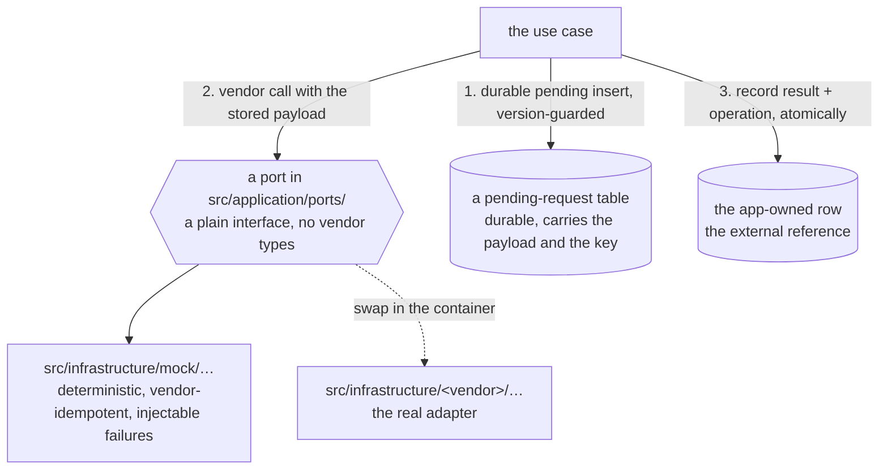

Three rules any such feature has to obey:

1. **A local write and a vendor call are two steps, never one transaction.** There is no
   distributed transaction and neither does the vendor. So an immutable pending request is
   written first, carrying the exact payload and an idempotency key derived from our own
   resource id; only then is the vendor called; the "sent" state is a separate, version-guarded
   commit. Nothing may precede the durable insert.
2. **A retry reconciles, it does not repeat.** A timeout may mean the request was accepted. The
   pending row stays, the use case returns `EXTERNAL` with a message saying a retry will
   reconcile it, and the retry asks the vendor with the same key and records the answer — even
   if the local record has moved on in the meantime.
3. **Undo applies only to data we own.** An external effect is classified `compensatable` (a
   documented compensating command exists) or `irreversible`, never `reversible`. An
   irreversible action sets `needsApproval: true`, so the agent must obtain a human approval for
   that exact call, and any undo that would contradict the external state has to be refused
   inside the atomic write, not only before it.

`docs/integrations.md` walks a worked example of the whole flow and says where a vendor's
credentials belong. Nothing in this repository implements it today: the example there is
illustrative, not a file you can open.

## 9. Audit, history and undo

Two records, deliberately separate.

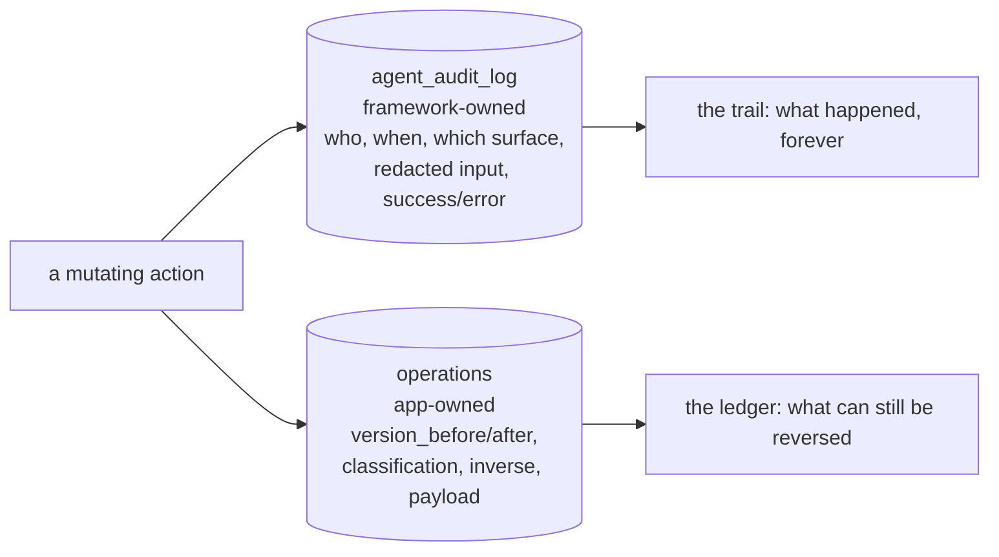

`agent_audit_log` is the framework's, written automatically for every non-GET action including
the ones that failed or were denied, and it is not something the application can rewrite. The
`operations` table is ours, and it exists because undoing a change needs something the audit
trail does not carry: the versions the change moved the record between, and the inverse command
that reverses it.

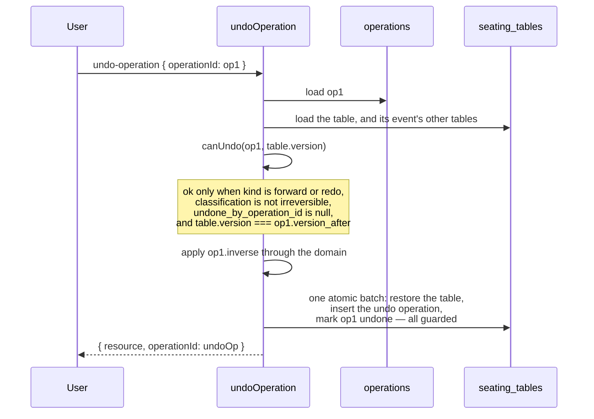

The version rule is the whole point. Labelling a seat on `tbl_head` moves it 3 → 4 and records
`version_after: 4`. Undo is allowed only while the table is still at version 4. If anyone
changed it since — the same user in another tab, a coworker, the agent — undo is refused with
`CONFLICT: Newer changes exist; undo refused` rather than silently discarding that change.

Seating adds a second way an undo can legitimately fail, and it is the more interesting one. A
seating inverse restores a _place_, not just a value: `restore-seating-table-position` puts a
table back where it stood, and that space may have been taken while it was away. So the restore
functions in `src/domain/seating-table.ts` re-run the placement rules, and the write carries the
same free-space predicate a forward move does. An undo that cannot be granted says so, with
`INVARIANT: Tables may not overlap`, instead of producing a plan that violates its own rule.
`tests/e2e/undo-conflict.spec.ts` performs exactly that race through the real UI and HTTP.

An undo is itself an operation row (kind `undo`), which is what makes it visible in `/activity`
and what makes redo possible. `redo-operation` takes that undo row, walks to the forward
operation it points at, and re-runs the original domain transition with the stored `payload`
under the same version rule. Classification per command:

| Command                                | Classification  | Reversed by                                                    |
| -------------------------------------- | --------------- | -------------------------------------------------------------- |
| `create-event`, `create-seating-table` | `compensatable` | Archiving the new record; creates are never deleted or redone  |
| `archive-event`                        | `reversible`    | `restore-event` (needs `events:archive`)                       |
| `move-seating-table`                   | `reversible`    | `restore-seating-table-position` to the recorded cell          |
| `rotate-seating-table`                 | `reversible`    | `restore-seating-table-rotation`, and where it stood           |
| `reshape-seating-table`                | `reversible`    | `restore-seating-table-shape`, seats and their labels included |
| `label-seat`                           | `reversible`    | `restore-seat-label` to the name that was there                |
| `archive-seating-table`                | `reversible`    | `restore-seating-table`, while the space is still free         |

`docs/undo-and-history.md` has the algorithm, the refusal messages and the UI behaviour.

## 10. Two schema owners

The single most surprising thing about this stack, and the source of most confusing first-run
failures.

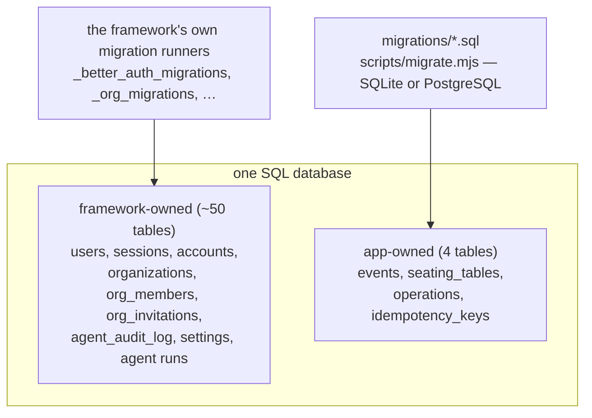

**The framework owns its tables and migrates them itself, at runtime, on the first database
touch.** Not at deploy time, not from a file you can read. The dev server does it at boot; a
deployed environment does it during the first request that touches the database —
`GET /_agent-native/health` is enough — and it takes a few seconds once.
`AGENT_NATIVE_SKIP_ENSURE_TABLES` is never set.

**We own ours**, in `migrations/*.sql`, applied by `scripts/migrate.mjs` against whatever
`DATABASE_URL` names. Same files, same order, every environment, both dialects. No `drizzle-kit push` anywhere; `server/db/schema.ts` is a typed mirror the
framework and its doctor expect, not the source of truth.

Three consequences you will meet:

- **A freshly migrated database has no `organizations` table.** So `pnpm db:reset && pnpm db:seed`
  fails unless a server has opened the database in between: the seed inserts organization rows.
  Start the app first. `scripts/seed.mjs` recognises the error and prints that instruction.
- **Hermetic tests that never start a server** must create those two tables themselves from the
  framework's DDL. `tests/integration/framework-tables.ts` does exactly that, and is the only
  copy of a framework table definition in the repository.
- **`/api/ready` only counts app migrations.** It compares `d1_migrations` against
  `src/infrastructure/migrations-manifest.ts`, generated from `migrations/` and committed, so
  the answer does not depend on what happens to be on disk. The framework's tables are not its
  business.

`docs/database-and-migrations.md` covers expand/contract, the deploy ordering constraint, and
why a code rollback does not roll back the database.

## 11. CI and CD

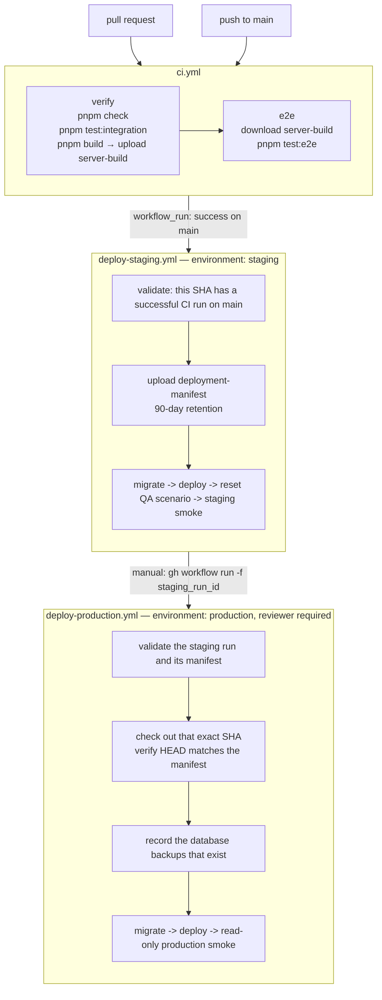

What is promoted is a **commit**. The platform builds from the git push, so production cannot
download the bytes staging ran; what the chain guarantees instead is that the commit production
builds is the commit staging deployed and smoked. That is a narrower promise than the Cloudflare
arrangement's, and stating it honestly is better than implying the old one still holds.

Provenance is a manifest, not a workflow-run field. A `workflow_run`-triggered run's `head_sha`
describes the context the workflow file was loaded from, so two runs can report the same
`head_sha` having deployed different commits. Staging therefore proves the SHA at the moment it
deploys and writes an immutable `deployment-manifest` artifact `{ repository, sha,
sourceCiRunId }`; production re-validates that manifest, the staging run's workflow path,
repository, branch, status and conclusion, and the CI run that actually verified that SHA. Then
it checks that SHA out and refuses unless `git rev-parse HEAD` and the manifest agree.
`tests/guards/deployment-validation.test.mjs` unit-tests every one of those refusals.

## 12. Staging and production separation

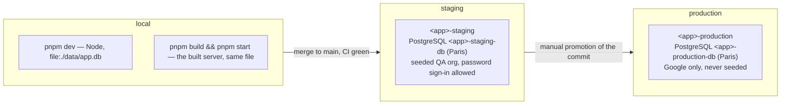

Separate applications, separate databases, separate settings, separate GitHub environments.
Nothing is shared, and no credential reaches both.

|                  | local                | CI               | staging           | production                 |
| ---------------- | -------------------- | ---------------- | ----------------- | -------------------------- |
| `APP_ENV`        | `local`              | `ci`             | `staging`         | `production`               |
| Database         | `file:./data/app.db` | a temporary file | PostgreSQL        | PostgreSQL                 |
| Password sign-up | yes                  | yes              | yes (QA)          | **refused**                |
| Google sign-in   | —                    | —                | configured        | required, per organization |
| `SEED_ENABLED`   | `1`                  | `1`              | `1` (QA org only) | **forbidden**              |
| Audit retention  | —                    | —                | 365 days          | forever (`0`)              |

`server/plugins/00-env-check.ts` refuses to start a misconfigured deployment. Production
requires `BETTER_AUTH_SECRET` (32+ characters), `OAUTH_STATE_SECRET`, an https `APP_URL`, the
Google credentials and `ANTHROPIC_API_KEY`, and forbids `AUTH_DISABLED`, `SEED_ENABLED`,
`ACCESS_TOKEN(S)` and `AGENT_PROD_CODE_EXECUTION`. Local refuses `APP_ENV=production`.
Violation messages never contain a value. `scripts/check-config-hygiene.mjs` fails the build if
a telemetry key appears anywhere or an example file carries a value.

## 13. Backup and recovery

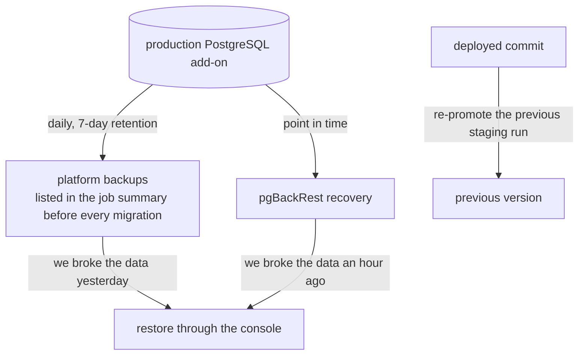

One layer, not two. The plan takes a daily backup with seven-day retention and supports
point-in-time recovery; this repository writes no backups of its own. That is a smaller surface
than the nightly-export arrangement it replaced — no object-storage credentials, no encryption
recipient, no export script to have silently failed — and a real dependency on the platform in
exchange. `docs/runbook.md` § _Verify the most recent backup_ is how you stop trusting it
blindly.

Three things a backup does not cover, and it matters: uploaded files (this starter stores
none), application settings (`clever env` can read them back, which the Worker secrets it
replaced could not — but a restore paired with a different `BETTER_AUTH_SECRET` still
invalidates every session), and the deployed code, which is git.

Rolling the code back does **not** roll back the database. A migration that ran is still
applied. That is why every migration must be backwards compatible with the version still
serving traffic, why migrations run before the deploy so a failed one takes nothing down, and
why the backup list is recorded before the migration rather than after.

`docs/backups.md` has the configuration, the coverage list, the verification procedure and the
step-by-step restore. `docs/runbook.md` is the incident-time version.

## 14. What this design deliberately avoids

Each of these is a real option that was considered and rejected for this class of application —
one company, 1–20 users, modest data, years of it.

- **Generic CRUD actions.** `updateSeatingTable({ gridX, gridY, seats })` moves the business
  rules to the caller and gives the agent a tool whose name means nothing. `move-seating-table`
  and `label-seat` each carry their own rule, audit summary, inverse and description the model
  reads — and `move-seating-table` is the one that knows a move needs the free-space guard while
  a label does not.
- **Direct frontend database access.** Every authorization check would have to be reimplemented
  in the client, where it is advice rather than enforcement. The browser gets actions.
- **Unrestricted agent database access.** `database: "off"`. Model output is untrusted input;
  a generic `db-query` tool turns a prompt injection into an exfiltration primitive, and a
  generic `db-exec` turns it into a delete.
- **Event sourcing.** The `operations` table gives history, audit and undo for the two
  aggregates that need them. Rebuilding all state from an event log would cost a projection
  layer and a replay story to answer questions nobody is asking.
- **Microservices.** Two deployables would need a network protocol, two deployment pipelines
  and distributed failure handling, to separate code that ships together and shares a database.
- **A message broker.** Nothing here is asynchronous by requirement. The one external write
  uses a durable pending request and idempotent retries, which is the same reliability property
  a queue would provide, with one table instead of one more piece of infrastructure.
- **Kubernetes.** One Node process and one SQL database have no orchestration problem to solve.
- **Multi-region.** One database in Paris, chosen for data residency rather than latency. A
  single small company's users are not distributed enough for replication to pay for its
  consistency cost — and the application and its database are deliberately in the _same_ zone,
  which is the one latency decision that does matter here.
- **An identity fence in front of production.** The application authenticates its own users; a
  second fence would double the sign-in surface. It stays an optional documented measure for
  staging.
- **An elaborate DI container.** `src/infrastructure/container.ts` is one function returning
  one object literal.
