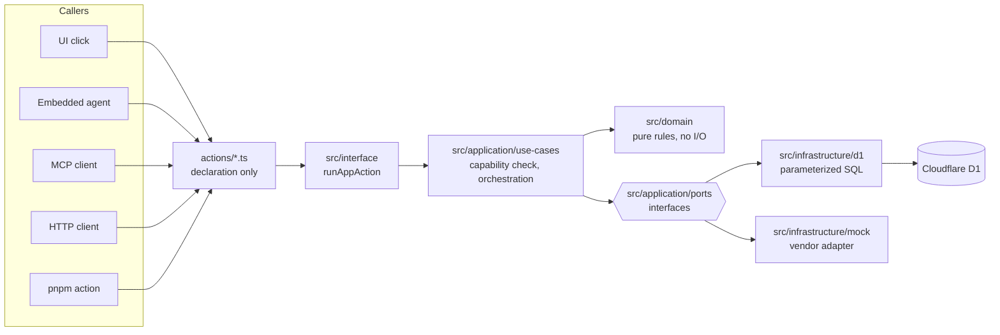

# Agent-Native + Cloudflare starter

An opinionated starter for small **production** business applications: a modular monolith on
Cloudflare Workers and D1, built with [Agent-Native](https://agent-native.com), where the
embedded AI agent and the human user do the same work through the same code.

It is deliberately boring. One Worker, one SQL database, no queues, no event sourcing, no
Kubernetes. What it is not casual about is the things that hurt a real business: authorization
that lives in the application and not the UI, one organization's data never reaching another,
an audit row for every change, undo that refuses to overwrite somebody else's work, tests that
run against the real Worker, and a restore procedure that has actually been tested.

## What it includes

- **Agent-Native 0.176.5** — actions, an embedded agent, an MCP endpoint, an audit log, an
  organization model and an i18n runtime, pinned exactly.
- **React 19 + React Router 8 + TypeScript** in strict mode, with the framework's toolkit
  components.
- **Better Auth** through the framework: email/password for local and QA, Google sign-in for
  production, invite-only membership.
- **Organizations with roles** (`owner`, `admin`, `member`) mapped to capabilities in one
  policy module. Cross-organization access is impossible by construction and tested at three
  levels.
- **A use-case architecture** with enforced boundaries: a pure domain, an application layer
  that knows no framework, infrastructure behind ports, and a UI that contains no business
  rules. A build-time checker fails on a forbidden import.
- **Actions as the only entry point.** A UI click, an agent tool call, an MCP call, an HTTP
  request and a CLI invocation all reach the same action and the same use case.
- **Cloudflare D1** with hand-written parameterized SQL, an `org_id = ?` predicate on every
  statement, optimistic-concurrency version guards and atomic multi-statement writes.
- **An audit trail and a semantic undo ledger.** Every mutation writes an operation row with
  its inverse; undo replays that inverse through the domain and refuses when newer changes
  exist. Redo re-runs the forward command.
- **One external integration**, `send-job-to-accounting`, showing the two-step write, the
  idempotency key, the durable pending request and the `needsApproval` gate for the agent.
- **A hermetic test pyramid**: unit and application tests with in-memory doubles, integration
  tests against real SQL, a Worker smoke against the built bundle, and Playwright driving the
  real Worker on a throwaway D1. No test touches a cloud resource.
- **Staging and production deployment** from GitHub Actions, built once and promoted by
  artifact with a required reviewer.
- **Backup foundations**: D1 Time Travel bookmarks around every release, a nightly SQL export,
  and a restore-check script.
- **Instructions for coding agents** (`AGENTS.md`, `ARCHITECTURE.md`, `docs/`) and for the
  deployed runtime agent (`agent/AGENTS.md`) — two audiences, two files.

## Quick start

```bash
git clone <this repository> my-app && cd my-app
pnpm install
cp .env.example .env                  # then put `openssl rand -hex 32` in BETTER_AUTH_SECRET
pnpm db:reset                         # rebuild both local databases from migrations/ alone
pnpm dev                              # http://localhost:8080 — leave it running
```

In a second terminal:

```bash
pnpm db:seed                          # deterministic sample data and five users — Node runtime only
```

Sign in as `owner@example.invalid` with the `SEED_PASSWORD` from `.env`
(`Example-Seed-Password-2026` by default).

The seed needs a server that has already opened the database: the framework creates its own
tables — users, organizations, the audit log — during the first request that touches it, and
the seed writes organization rows into them. `pnpm dev` does that at boot.

To run the real Cloudflare Worker instead of the Node dev server:

```bash
pnpm dev:worker                       # builds dist/ and serves it on http://127.0.0.1:8787
pnpm db:seed:worker                   # a different database — see below
```

**The two runtimes have separate databases, and separate seeds.** `pnpm dev` serves the Node
dev server on `data/app.db` and is seeded by `pnpm db:seed`; `pnpm dev:worker` serves the built
Worker on the local D1 under `.wrangler/` and is seeded by `pnpm db:seed:worker`. Seeding one
does nothing for the other, and the order matters in both cases: the server has to boot first,
because the framework creates its own tables on the first request that touches the database.

So if `pnpm dev:worker` gives you a sign-in page that rejects every password, the likely cause
is an unseeded database rather than a wrong one — no account exists to sign in to. Check with:

```bash
pnpm exec wrangler d1 execute example-jobs-local --local --command "SELECT count(*) FROM user"
```

Zero means run `pnpm db:seed:worker` while `pnpm dev:worker` is up. The seed password is the
same in both runtimes: `SEED_PASSWORD` from `.env` for the Node server and from `.dev.vars` for
the Worker, both defaulting to the `Example-Seed-Password-2026` the examples name.

## Architecture



Every arrow into `actions/` is a different surface; everything from there down happens once.
`ARCHITECTURE.md` explains each layer, with diagrams for request flow, parity, authorization,
organization scoping, ports, undo, CI/CD and recovery.

## The example application

A generic field-service application, so the architecture is visible without domain knowledge:

- An **organization** ("Acme Services") has **members** with a role.
- A **customer** has a name, contact details and notes, and is `active` or `archived`.
- A **job** belongs to one customer and moves `scheduled` → `in_progress` → `completed`, or
  `archived` from any of those. A completed job can be exported to accounting once.
- Every change writes an **operation** recording who did it, from which surface, and how to
  reverse it. `/activity` shows the history with Undo and Redo.

Fifteen actions cover it: five queries, eight commands, and undo/redo. The interesting ones
are `complete-job` (reversible, and the worked example throughout the docs),
`undo-operation` (refuses when the record moved on) and `send-job-to-accounting`
(irreversible, admin-only, needs the agent to obtain human approval).

Delete all of it when you build your own — `docs/adding-a-feature.md` walks through adding a
feature end to end so you know what to keep.

## Authentication

| Environment | How people sign in                                                                                   |
| ----------- | ---------------------------------------------------------------------------------------------------- |
| Local, CI   | Seeded email/password accounts. The framework's localhost auto-sign-in is off.                       |
| Staging     | The same seeded QA accounts, plus Google once it is configured.                                      |
| Production  | **Google only.** Password sign-up is refused by configuration, and the organization requires Google. |

Membership is invite-only everywhere: no environment creates an organization for a stray
account, so an authenticated stranger can read nothing. `docs/authentication-and-authorization.md`
has the Google client setup, the redirect URI, the roles table and how to add another provider.

## Deployment

Pushing to `main` runs CI; a green CI run deploys staging, migrates it and smokes it.
Production is a manual promotion of that exact artifact, gated by a required reviewer, which
records a D1 Time Travel bookmark before it migrates. Nothing is ever rebuilt for production.

`docs/deployment.md` for the environments and the workflows, `docs/runbook.md` for what to do
when something breaks, `docs/backups.md` for the backup and restore model.

## Creating a new app from this template

Click **Use this template** on GitHub — or, after the first stable tag, use the Agent-Native
CLI's community template path — then follow **[`docs/bootstrap.md`](docs/bootstrap.md)**.

`scripts/bootstrap.mjs` performs every automatable setup step from one git-ignored input file:
the two D1 databases in the EU jurisdiction, the Wrangler ids and URLs, the first deployment,
the Worker secrets, the GitHub environments, secrets and variables, and branch protection. It
prints a plan by default and needs `--yes` to create anything.

Applications created from the template develop independently; they do not stay rebased on it.
`docs/template-workflow.md` covers porting improvements in either direction with
`git format-patch` / `git am --3way`, and who should own which account.

## Requirements and cost

- **Node 22 or newer** (`.nvmrc` pins 22 for CI) and **pnpm 11**.
- **A Cloudflare account on the Workers Paid plan** — 5 USD per month at the time of writing.
  The Worker bundle is about 4 MB compressed and the Free plan allows 3 MB. CI fails above
  8 MiB to keep margin.
- **An Anthropic API key** for the embedded agent, billed to whoever owns the deployment.
- **A Google Cloud project** for production sign-in.
- D1 storage and Workers requests for an application of this size sit inside the Paid plan's
  included usage.

## Philosophy

- **Capabilities, not CRUD.** `complete-job`, never `updateJob({status})`. An action names
  something the business does, and its name is what the agent sees.
- **Humans and agents share use cases.** Parity is not a feature; it is the consequence of
  having one implementation.
- **Security lives in the application boundary.** Not the UI, not a hook, not a prompt. Hide a
  button if you like — the server refuses anyway, and a test proves it.
- **Boring infrastructure.** One Worker, one database, one deployment path. Every piece you do
  not have cannot break at 2am.
- **Deterministic tests.** Fixed ids, fixed timestamps, no random data, no network. A test
  that fails means the code changed.
- **Reversible where practical, honest where not.** Every command is classified reversible,
  compensatable or irreversible, and the irreversible ones say so to the user and to the agent.
- **A small system should still be a reliable system.** Twenty users and one company is not a
  reason to lose their data.

## License

MIT. See [LICENSE](LICENSE). No customer-specific information is in this repository; sample
names are `Acme Services`, `Example Customer A` and addresses under `example.invalid`.
