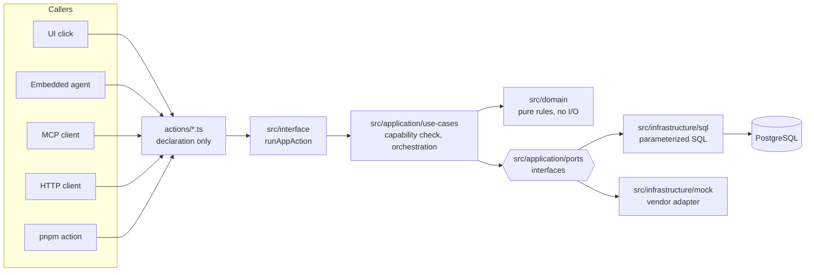

# Agent-Native + Clever Cloud starter

An opinionated starter for small **production** business applications: a modular monolith on
Clever Cloud and PostgreSQL, built with [Agent-Native](https://agent-native.com), where the
embedded AI agent and the human user do the same work through the same code.

It is deliberately boring. One always-on Node server, one SQL database, no queues, no event
sourcing, no Kubernetes. What it is not casual about is the things that hurt a real business:
authorization that lives in the application and not the UI, one organization's data never
reaching another, an audit row for every change, undo that refuses to overwrite somebody
else's work, tests that run against the real built server, and a restore procedure that has
actually been tested.

It ran on Cloudflare Workers first. It does not any more, and
[`docs/plan/tasks/T28-clever-cloud-migration.md`](docs/plan/tasks/T28-clever-cloud-migration.md)
says why in measurements rather than opinions.

## What it includes

- **Agent-Native 0.176.5** — actions, an embedded agent, an MCP endpoint, an audit log, an
  organization model and an i18n runtime, pinned exactly.
- **React 19 + React Router 8 + TypeScript** in strict mode, with the framework's toolkit
  components.
- **Better Auth** through the framework: email/password for local and QA, Google sign-in for
  production, invite-only membership.
- **Organizations with roles** (`owner`, `admin`, `member`) mapped to capabilities in one
  policy module. Cross-organization access is impossible by construction and tested at three
  levels.
- **A use-case architecture** with enforced boundaries: a pure domain, an application layer
  that knows no framework, infrastructure behind ports, and a UI that contains no business
  rules. A build-time checker fails on a forbidden import.
- **Actions as the only entry point.** A UI click, an agent tool call, an MCP call, an HTTP
  request and a CLI invocation all reach the same action and the same use case.
- **PostgreSQL** with hand-written parameterized SQL, an `org_id = ?` predicate on every
  statement, optimistic-concurrency version guards and atomic multi-statement writes. The same
  statements run against a local SQLite file in development, unchanged.
- **An audit trail and a semantic undo ledger.** Every mutation writes an operation row with
  its inverse; undo replays that inverse through the domain and refuses when newer changes
  exist. Redo re-runs the forward command.
- **A hermetic test pyramid**: unit and application tests with in-memory doubles, integration
  tests against real SQL, a smoke against the built server, and Playwright driving that server
  on a throwaway database. No test touches a cloud resource.
- **Staging and production deployment** from GitHub Actions, promoted as an exact commit with
  a required reviewer, migrations applied before the deploy so a bad one fails the deployment
  rather than the running application.
- **Managed backups**: the PostgreSQL add-on takes a daily backup with seven-day retention and
  supports point-in-time restore, and the promotion records what exists before it runs.
- **Instructions for coding agents** (`AGENTS.md`, `ARCHITECTURE.md`, `docs/`) and for the
  deployed runtime agent (`agent/AGENTS.md`) — two audiences, two files.

## Quick start

```bash
git clone <this repository> my-app && cd my-app
pnpm install
cp .env.example .env                  # then put `openssl rand -hex 32` in BETTER_AUTH_SECRET
pnpm db:reset                         # rebuild both local databases from migrations/ alone
pnpm dev                              # http://localhost:8080 — leave it running
```

In a second terminal:

```bash
pnpm db:seed                          # deterministic sample data and five users — Node runtime only
```

Sign in as `owner@example.invalid` with the `SEED_PASSWORD` from `.env`
(`Example-Seed-Password-2026` by default).

The seed needs a server that has already opened the database: the framework creates its own
tables — users, organizations, the audit log — during the first request that touches it, and
the seed writes organization rows into them. `pnpm dev` does that at boot.

To run the built production server instead of the dev server:

```bash
pnpm build && pnpm start              # serves on http://localhost:3000 (PORT overrides it)
```

**One database, one seed.** Both `pnpm dev` and `pnpm start` read `DATABASE_URL`, which
defaults to the SQLite file at `data/app.db`, and `pnpm db:seed` fills it. The order matters:
the server has to boot first, because the framework creates its own tables on the first
request that touches the database.

So if the sign-in page rejects every password, the likely cause is an unseeded database rather
than a wrong one — no account exists to sign in to. Run `pnpm db:seed` while the server is up.
The seed password is `SEED_PASSWORD` from `.env`, defaulting to the
`Example-Seed-Password-2026` the examples name.

To point either runtime at a deployed PostgreSQL instead — to reproduce something, never to
edit real data — set `DATABASE_URL` to its connection string. `pnpm db:reset` refuses to run
against anything that is not a local file, because it deletes.

## Architecture



Every arrow into `actions/` is a different surface; everything from there down happens once.
`ARCHITECTURE.md` explains each layer, with diagrams for request flow, parity, authorization,
organization scoping, ports, undo, CI/CD and recovery.

## The application

Seating plans for events — who sits where, at which table, in which room:

- An **organization** ("Acme Services") has **members** with a role.
- An **event** is the occasion a plan belongs to: a name, a start time, and `active` or
  `archived`. Each event owns exactly one floor plan.
- Each event owns its **room** — the floor its tables stand on, `roomWidth` by `roomHeight` in
  grid cells, starting at 16 by 10 and resizable. A shrink that would strand a table is refused.
- A **seating table** is **rectangular or round**, never itself bent: a `kind`, a `size` (a
  rectangle's length or a round table's diameter), whether it has `endSeats`, and a `rotation`
  in quarter turns. **Two tables may never cover the same cell** — a rule enforced by a primary
  key on the cells a table occupies, not by a check before the write, so two people dragging at
  once cannot produce a plan that breaks it.
- A **seat** is a chair, numbered clockwise around the table's outline from 0 and _derived_ from
  the shape: a rectangle of length n has 2n plus its ends, a round table of diameter n has 4n.
  Its label is whoever sits there.
- An L- or U-shaped **arrangement** is several tables standing end to end, with the chairs that
  would be inside a neighbour's body taken off. `bootstrap-event-layout` builds one on an empty
  plan and grows the room to hold it.
- Every change writes an **operation** recording who did it, from which surface, and how to
  reverse it. `/activity` shows the history with Undo and Redo.

Sixteen actions cover it: two queries, twelve commands, and undo/redo. The interesting ones are
`move-seating-table` (reversible, and the worked example throughout the docs — its undo can
legitimately fail, because the space it wants back may have been taken),
`bootstrap-event-layout` (one operation that places a dozen tables and may enlarge the room, and
one Undo that takes all of it back) and `undo-operation` (refuses when the record moved on).

`docs/adding-a-feature.md` walks through adding a feature end to end.

## Authentication

| Environment | How people sign in                                                                                   |
| ----------- | ---------------------------------------------------------------------------------------------------- |
| Local, CI   | Seeded email/password accounts. The framework's localhost auto-sign-in is off.                       |
| Staging     | The same seeded QA accounts, plus Google once it is configured.                                      |
| Production  | **Google only.** Password sign-up is refused by configuration, and the organization requires Google. |

Membership is invite-only everywhere: no environment creates an organization for a stray
account, so an authenticated stranger can read nothing. `docs/authentication-and-authorization.md`
has the Google client setup, the redirect URI, the roles table and how to add another provider.

## Deployment

Pushing to `main` runs CI; a green CI run migrates staging, deploys it and smokes it.
Production is a manual promotion of that exact commit, gated by a required reviewer, which
records the database backups that exist before it migrates. Migrations run before the deploy,
so a bad one fails the deployment instead of the running application.

`docs/deployment.md` for the environments and the workflows, `docs/runbook.md` for what to do
when something breaks, `docs/backups.md` for the backup and restore model.

## Creating a new app from this template

Click **Use this template** on GitHub — or, after the first stable tag, use the Agent-Native
CLI's community template path — then follow **[`docs/bootstrap.md`](docs/bootstrap.md)**.

`scripts/bootstrap.mjs` performs every automatable setup step from one git-ignored input file:
a Node application and a managed PostgreSQL add-on per environment, linked together, every
application setting, the first deployment, the GitHub environments, secrets and variables, and
branch protection. It prints a plan by default and needs `--yes` to create anything.

No Clever Cloud credential goes in that file. `clever login` writes a profile once; bootstrap
reads it for its own calls and copies it into the two GitHub secrets CI deploys with. The
application URLs are outputs rather than inputs — the platform assigns them and bootstrap
reads them back.

Applications created from the template develop independently; they do not stay rebased on it.
`docs/template-workflow.md` covers porting improvements in either direction with
`git format-patch` / `git am --3way`, and who should own which account.

## Requirements and cost

- **Node 22 or newer** (`.nvmrc` pins 22 for CI) and **pnpm 11**.
- **A Clever Cloud account with a payment method.** The PostgreSQL plan this starter uses is
  `xxs_sml`, 5.25 EUR per month per environment at the time of writing. The free `dev` plan
  cannot run it: that plan allows five connections and the framework opens a pool of twenty
  with no way to configure it down, which is measured rather than assumed.
- **An Anthropic API key** for the embedded agent, billed to whoever owns the deployment.
- **A Google Cloud project** for production sign-in.
- Applications run on the smallest instance size. Builds use a dedicated instance billed per
  build minute, because the default one runs out of memory installing a thousand packages.

## Philosophy

- **Capabilities, not CRUD.** `move-seating-table`, never `updateTable({gridX, gridY})`. An
  action names something the business does, and its name is what the agent sees.
- **Humans and agents share use cases.** Parity is not a feature; it is the consequence of
  having one implementation.
- **Security lives in the application boundary.** Not the UI, not a hook, not a prompt. Hide a
  button if you like — the server refuses anyway, and a test proves it.
- **Boring infrastructure.** One server, one database, one deployment path. Every piece you do
  not have cannot break at 2am.
- **Deterministic tests.** Fixed ids, fixed timestamps, no random data, no network. A test
  that fails means the code changed.
- **Reversible where practical, honest where not.** Every command is classified reversible,
  compensatable or irreversible, and the irreversible ones say so to the user and to the agent.
- **A small system should still be a reliable system.** Twenty users and one company is not a
  reason to lose their data.

## License

MIT. See [LICENSE](LICENSE). No customer-specific information is in this repository; sample
names are `Acme Services`, `Spring Gala` and addresses under `example.invalid`.
