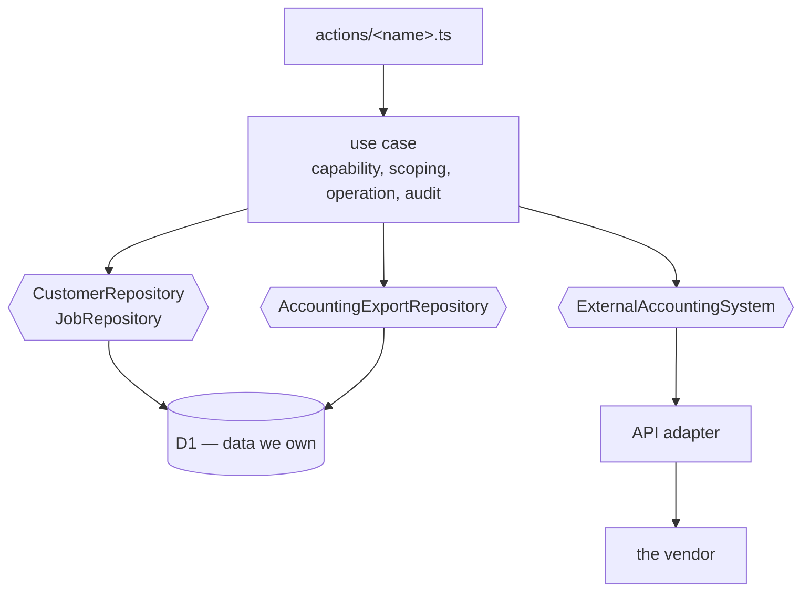
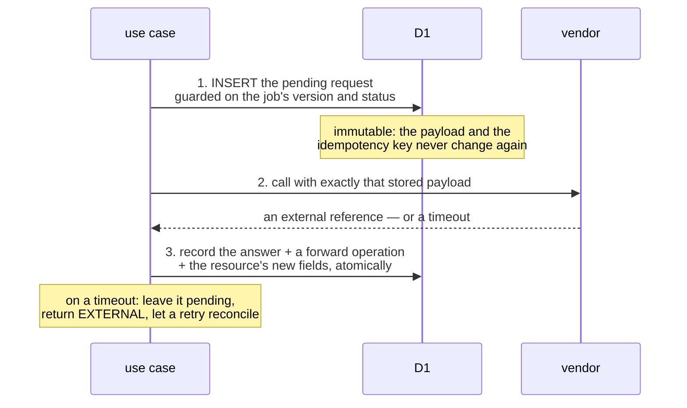

# Integrations

Most real applications built from this template will do more talking to somebody else's system
than to their own database. That does not change the architecture: it changes what lives behind
a port.

This document is longer than the others because the failure modes are genuinely harder. A local
write either happened or it did not. A vendor call may have happened without you finding out.

- [The boundary that never moves](#the-boundary-that-never-moves)
- [Where the data lives](#where-the-data-lives)
- [The two-step write](#the-two-step-write)
- [Classifying external effects](#classifying-external-effects)
- [Approval for the agent](#approval-for-the-agent)
- [MCP or the vendor's API?](#mcp-or-the-vendors-api)
- [Error mapping and timeouts](#error-mapping-and-timeouts)
- [The worked example: `send-job-to-accounting`](#the-worked-example-send-job-to-accounting)
- [Replacing the mock with a real adapter](#replacing-the-mock-with-a-real-adapter)
- [Where the credentials live](#where-the-credentials-live)
- [Testing an integration](#testing-an-integration)

## The boundary that never moves

Nothing above the port changes when an integration replaces a table. A use case still:

1. resolves the actor from the request context;
2. checks a capability;
3. scopes everything to the actor's organization;
4. validates its input;
5. records an operation;
6. is audited automatically.

What changes is the adapter behind the port. An aggregate we own lives in D1 and is reached
through a repository; an aggregate the vendor owns is reached through an API adapter. The use
case cannot tell the difference, and neither can its tests.



Three ports in that picture, and the third is the important one: the durable record of *our
intent* to call the vendor is data we own, so it lives in D1 next to everything else.

## Where the data lives

| Kind of data | Where | Reached through |
| --- | --- | --- |
| Aggregates we own | D1 | A repository port |
| Our intent to call the vendor, and the vendor's answer | D1 (`accounting_exports`) | A repository port |
| Aggregates the vendor owns | The vendor | An API adapter behind a port |
| A read model or cache synced from the vendor | D1 | A repository port, refreshed by a sync |
| The vendor's credentials | Worker secrets | `src/infrastructure/<vendor>/` only |

Three rules follow from that table.

**Never store a copy of a vendor-owned aggregate and call it the truth.** Store the vendor's
identifier for it (`jobs.accounting_reference`), and read the rest from the vendor when you need
it. A copy that nobody reconciles becomes a second, wrong answer.

**Do store an optional read model when the UI needs to list or filter vendor data.** A list page
that fans out one API call per row is not a page. Sync it, timestamp it, show the user when it
was last synced, and treat it as a cache: never write to it as if it were authoritative, and
never let a stale read model gate a write. The write goes to the vendor and the vendor's answer
updates the model.

**Always store the request.** Which is the next section.

## The two-step write

A local write and a vendor call are **two steps, never one transaction**. D1 has no distributed
transaction, the vendor certainly does not, and pretending otherwise produces the two worst
outcomes: a local row saying we sent something we never sent, or a vendor record nothing local
knows about.



**Step 1 must precede any vendor call.** It is the only thing that makes a retry safe: after a
crash, a timeout or a redeploy, the request is still there with the same payload and the same
key.

**The idempotency key is derived from our resource id**, not generated per attempt:
`job:<jobId>`. A key that changes between attempts is not an idempotency key — it is a
guarantee of duplicates. Deriving it from something stable means every retry, from any process,
asks the vendor the same question.

**Step 3 is a separate, version-guarded commit.** It reloads the current resource and guards on
its version, so an intervening change is not overwritten. If another writer wins, the request
stays pending for a later retry and the vendor's answer is never lost.

**A retry reconciles.** It finds the stored request, calls the vendor with the same key, and
records the answer — even if the resource has changed status since, even if it has been
archived. Reconciliation of an existing pending request is permitted regardless of the
resource's current state, because the intent is already durable and the vendor may already have
acted on it.

**A completed request replays for free.** A second call returns the recorded reference and the
recorded operation id, with no second vendor effect and no second operation row.

## Classifying external effects

| Classification | Use when | Consequence |
| --- | --- | --- |
| `compensatable` | The vendor has a documented call that reverses the effect | Record the compensating command; the UI may offer it as a distinct action, not as "undo" |
| `irreversible` | It cannot be reversed, or reversing it is a manual business process | No undo affordance at all; say so in the description and in the confirmation dialog |

**Never `reversible`.** That word is reserved for data we own and can restore exactly. We do not
own the vendor's data, so we cannot promise to restore it — an invoice draft the vendor has
already emailed is not something an `UPDATE` can retract.

If the vendor's "reverse" is a credit note rather than a deletion, that is a *compensating
command*, and it belongs in the UI as its own action with its own name and its own audit row.
Calling it "undo" would tell the user the invoice never existed, which is the opposite of what
happened.

## Approval for the agent

An irreversible external effect sets `needsApproval: true` on the action:

```ts
export default defineAction({
  description:
    "Create an invoice draft for a completed job in the accounting system. This external " +
    "effect is irreversible and requires approval. A retry safely reconciles a pending request.",
  needsApproval: true,
  // …
});
```

The framework then requires a human approval for **that exact call**, with those exact
arguments, before the tool runs. Not a session-wide permission, not a blanket "the agent may
export": one approval, one call.

The reason it is a framework mechanism rather than a prompt instruction is that a prompt is a
request and this is a constraint. `agent/AGENTS.md` also tells the runtime agent to ask before
this action, and `evals/accounting-approval.eval.ts` asserts that a model-backed run pauses for
approval and leaves no export request behind — but the gate holds whatever the model does.

## MCP or the vendor's API?

| | The vendor's API, behind a port | MCP |
| --- | --- | --- |
| Who calls it | Our adapter, from a use case | The agent, as a tool |
| Idempotency | Ours to control, per call | The server's, if it has any |
| Audit | Our operation row and audit row | Whatever the MCP server records |
| Authorization | Our capability check first | The token's scope |
| Determinism | A test can pin the exact request | The model chooses the arguments |

**Use the vendor's API behind a port for anything that writes.** The whole point of the
architecture is that an external write goes through our semantic action, which owns the
capability check, the idempotency key, the durable request and the classification. An MCP tool
that writes bypasses all four.

**MCP is reasonable for read-only exploration** the agent does on the user's behalf and nobody
depends on: looking something up in a vendor's documentation, searching a knowledge base. Even
then, remember what an MCP server is: somebody else's code choosing what to return to a model
that is going to act on it. Treat its output as untrusted input.

This application exposes MCP *outward* — our semantic actions as tools for an external client —
and consumes none.

## Error mapping and timeouts

The adapter throws `ExternalSystemError` (`src/application/ports/external-accounting.ts`) with
a message that is **already safe to show a user**. The use case maps it to
`AppError("EXTERNAL", "…: <message>. Retry will reconcile the pending request.")` → HTTP 502.

Rules for an adapter:

- **Never let a vendor's raw error out.** It may contain a URL, a token fragment, an internal
  identifier or a stack. Map the status codes you understand to a sentence a user can act on,
  and everything else to one generic sentence.
- **Set a timeout, and treat it as "unknown", not "failed".** A timed-out request may have been
  accepted. Leave the pending request pending, return `EXTERNAL`, and say that a retry will
  reconcile it. Never mark it failed and never write a local "not sent" state — that is how you
  end up invoicing twice.
- **Distinguish retryable from not.** A 429 or a 503 is worth retrying; a 400 is a bug in our
  request and retrying it forever is a way to hide it. A permanently unacceptable request
  should end up visible to a human, not looping.
- **Never retry inside the adapter without the same idempotency key.** The key belongs to the
  stored request, so the adapter receives it and must not invent one.

The user-facing string for `EXTERNAL` is in both i18n catalogs: *The external system did not
confirm the request. Try again; a retry reconciles it.*

## The worked example: `send-job-to-accounting`

This action exists to demonstrate the pattern with tests, not because the sample application
needs an accounting system. Files:

```
src/application/ports/external-accounting.ts      the port + ExternalSystemError
src/infrastructure/mock/mock-accounting.ts         the deterministic vendor double
src/application/ports.ts                           AccountingExport + its repository port
src/infrastructure/d1/accounting-exports-repository.ts   the SQL adapter
src/application/use-cases/send-job-to-accounting.ts      the use case
actions/send-job-to-accounting.ts                  the declaration
migrations/0002_job_accounting.sql                 the accounting columns + accounting_exports
```

### The port

```ts
export interface AccountingInvoiceDraft {
  idempotencyKey: string;
  orgId: string;
  customer: { id: string; name: string };
  job: { id: string; title: string; completedAt: string };
}

export interface ExternalAccountingSystem {
  createInvoiceDraft(
    input: AccountingInvoiceDraft,
  ): Promise<{ externalReference: string; alreadyExisted: boolean }>;
}

export class ExternalSystemError extends Error {}
```

Two details in that interface carry weight. The input is a **complete, self-contained payload**,
not a job id the adapter is expected to look up — because it is the payload that gets stored,
and a stored id would be re-read at retry time and might have changed. And the result carries
`alreadyExisted`, so the caller can tell a fresh acceptance from a replay.

### The table

```sql
CREATE TABLE accounting_exports (
  org_id TEXT NOT NULL,
  job_id TEXT NOT NULL,
  idempotency_key TEXT NOT NULL,
  request_json TEXT NOT NULL,      -- immutable: exactly what we send, every attempt
  status TEXT NOT NULL CHECK (status IN ('pending', 'completed')),
  external_reference TEXT,
  operation_id TEXT,
  requested_by TEXT NOT NULL,
  requested_at TEXT NOT NULL,
  completed_at TEXT,
  PRIMARY KEY (org_id, job_id),
  UNIQUE (org_id, idempotency_key)
);
```

`PRIMARY KEY (org_id, job_id)` is what makes two concurrent requests for the same job resolve
to one: the loser's insert fails, it reads the winner's row, and it proceeds with the winner's
payload and key. `UNIQUE (org_id, idempotency_key)` is the second belt.

### The use case, step by step

```ts
requireCapability(actor, "jobs:export");                      // admin and owner only

let request = await deps.accountingExports.getByJobId(actor.orgId, input.jobId);
if (request?.status === "completed") {
  return completedResult(await deps.jobs.getById(actor.orgId, input.jobId), request);
}
```

A completed request replays: the recorded reference, the recorded operation id, no vendor call.

```ts
if (!request) {
  const job = await deps.jobs.getById(actor.orgId, input.jobId);
  if (!job) throw new AppError("NOT_FOUND", "Job not found");
  // expectedVersion check
  if (job.status !== "completed")
    throw new AppError("INVARIANT", `Cannot send to accounting a job that is ${job.status}`);
  if (job.accountingReference !== null || !job.completedAt)
    throw new AppError("INVARIANT", "Job was already sent to accounting");
  const customer = await deps.customers.getById(actor.orgId, job.customerId);
  if (!customer) throw new AppError("NOT_FOUND", "Customer not found");

  request = await deps.accountingExports.createPending({
    export: { /* … the immutable payload, key `job:<jobId>` … */ },
    expectedVersion: job.version,
  });
  if (request.status === "completed") { /* a concurrent winner already finished */ }
}
```

`createPending` inserts **only** while the job is completed, unsent and at the expected version
— all in SQL, so the precondition and the insert cannot be separated by a race. A concurrent
winner's row is returned instead of an error.

```ts
try {
  vendorResult = await deps.accounting.createInvoiceDraft(request.request);
} catch (error) {
  if (error instanceof ExternalSystemError) {
    throw new AppError(
      "EXTERNAL",
      `Accounting system unavailable: ${error.message}. Retry will reconcile the pending request.`,
    );
  }
  throw new AppError("INTERNAL", "Unexpected error");
}
```

Note what is *not* here: no local write on failure. The pending request is the state.

```ts
request = await deps.accountingExports.recordAccepted({ /* … */ });

const current = await deps.jobs.getById(actor.orgId, input.jobId);   // reload
const next = applyDomain(() => reconcileAccountingExport(current, reference, now));
// … build the irreversible forward operation …
await deps.accountingExports.complete({ export: request, job: next, expectedVersion: current.version, operation });
```

The reload matters: the job may have been archived between step 1 and here, and the commit must
preserve that rather than write back the job as it was when the request was created.
`reconcileAccountingExport` sets the accounting fields and leaves everything else alone. If the
guarded commit loses to another writer, the code checks whether the winner completed the same
request — and if so returns the winner's result rather than failing a call whose effect
actually succeeded.

### And the history interaction

A durable accounting intent blocks any undo that would reopen the completed job — rechecked
inside the atomic write, not only before it — with `INVARIANT: A job with an accounting export
cannot be reopened`. Archiving remains possible, and so does restoring to `completed`, with the
accounting fields preserved. `get-job` returns `accountingExportStatus: "pending" | "completed"
| null` so an admin can see and retry a pending export even after the job has been archived.

## Replacing the mock with a real adapter

Four steps. Nothing above the port is one of them.

1. **Implement the port** in `src/infrastructure/<vendor>/<vendor>-accounting.ts`. It may
   import `src/domain`, `src/application` and `node:crypto`; it may not import `react` or
   `app/*`. Map the vendor's errors to `ExternalSystemError` with safe messages. Give it a
   timeout.
2. **Select it in the container** (`src/infrastructure/container.ts`). Choose on
   *configuration*, not on `APP_ENV` — the point is that staging can talk to the vendor's
   sandbox and production to the vendor's real API, both selected by which credentials are
   present, rather than by an environment name that also means twenty other things:

   ```ts
   const accounting = env.ACCOUNTING_API_URL
     ? createVendorAccounting({ baseUrl: env.ACCOUNTING_API_URL, token: env.ACCOUNTING_API_TOKEN })
     : createMockAccountingSystem();
   ```

3. **Keep the mock**, and keep it wired for tests. It is what makes the use-case tests
   deterministic and what lets them simulate response loss.
4. **Add the credentials as Worker secrets** per environment (next section) and to
   `.bootstrap.env.example` if the bootstrap script should set them.

The vendor's sandbox is worth insisting on. An integration whose tests only ever run against
the mock will meet the real API's opinions for the first time in production.

## Where the credentials live

| Environment | Where | How |
| --- | --- | --- |
| Local (`pnpm dev`) | `.env` | Git-ignored; only `.env.example` is committed, names only |
| Local Worker | `.dev.vars` | Git-ignored; only `.dev.vars.example` is committed |
| Staging, production | Worker secrets | `pnpm exec wrangler secret put ACCOUNTING_API_TOKEN --env <env>` |
| GitHub Actions | Environment secrets | Only if a *workflow* needs it. A Worker secret is not readable by a workflow, and should not be. |

Rules:

- **A vendor credential is a deployment-level secret, not a per-user one.** The application acts
  as itself against the vendor, and the audit row records which of *our* users caused the call.
  If the vendor requires per-user OAuth, that is a different design — the framework has a
  credential vault for it (`resolveCredential(key, { userEmail, orgId })`) — and it changes who
  the vendor thinks is calling.
- **Only the adapter reads them.** Not the use case, not the action, not the UI.
- **`scripts/check-config-hygiene.mjs` must know the name** if it is a secret, so a value parked
  in `wrangler.jsonc` `vars` fails the build instead of being deployed.
- **Never log one, and never let one into an error message.** The framework's doctor has a
  `no-env-credentials` guard that flags a `process.env` read outside its allowlist; if the read
  is legitimate, the marker is `// guard:allow-env-credential — <reason>` on the line above or
  trailing on the same line.

## Testing an integration

The mock (`src/infrastructure/mock/mock-accounting.ts`) is deliberately more than a stub. It
implements vendor idempotency across repeats, counts calls and acceptances, and can be told to
fail either **before** acceptance or **after** acceptance — the second being a lost response,
which is the case that makes reconciliation necessary and is otherwise impossible to reproduce.

```ts
accounting.failNextCall("gateway timeout", "after-acceptance");
```

The scenarios worth covering, all of which
`tests/unit/application/send-job-to-accounting.test.ts` and `accounting-history.test.ts` do:

| Scenario | Expected |
| --- | --- |
| Happy path | A reference, an irreversible operation, `accountingReference` set |
| Replay of a completed request | The same reference and operation id, no second vendor call |
| Two concurrent requests | One pending row, one vendor acceptance, both callers get the same reference |
| Failure before acceptance | `EXTERNAL`, request stays pending, no local change |
| Lost response after acceptance | `EXTERNAL`, request stays pending; a retry reconciles with the same key |
| Restart with a persisted pending request | The retry finds it and completes it |
| The job archived before the local commit | The archive survives; the accounting fields are added |
| Another writer wins the commit | The request stays pending; the reference is never lost |
| A member calls it | `AUTHORIZATION` |
| Another organization's job | `NOT_FOUND` |
| Undo of the completion afterwards | `INVARIANT: A job with an accounting export cannot be reopened` |

Do not test the vendor's API in the unit suite. Test *your adapter's* mapping — status code to
`ExternalSystemError`, timeout to a thrown error, the request body shape — against a fake HTTP
layer, and test the vendor itself against its sandbox, by hand or in a separate opt-in suite
that a pull request does not gate on.
